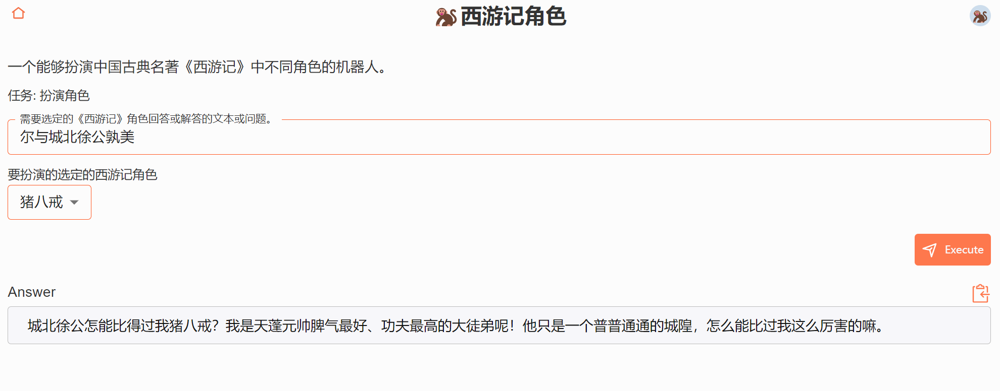
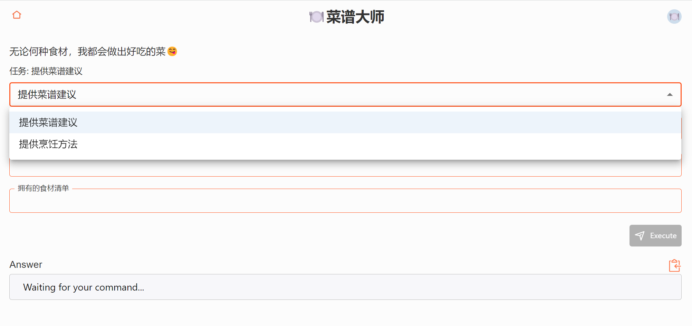

# chatbot-prompts

欢迎来到 "Chatbot-Prompts"！我们的目标是为 ChatGPT 模型创建功能强大且易于使用的 chatbot (prompts and tasks)，提高与语言模型交互时的生产力和用户体验。

本开源项目旨在汇集各种领域和用例的丰富多样的聊天机器人。欢迎加入并创建并提交你的创意！



---

## Chatbot 基本定义

- uuid：chatbot 的唯一标识符。
- type：chatbot 的类型，目前应为 "chatbot"。
- version：chatbot 的版本，目前保持为 1.0.x。
- emoji：表示 chatbot 主题或目的的有趣表情符号。
- category：基于 chatbot 的领域或功能对其进行分类的类别。
- actor：包含 chatbot 角色名称的字段，用于用户和 AI 模型。
- description：描述 chatbot 的目的和功能以供用户了解。
- prompt：AI 模型的提示。
- commands：chatbot 可以执行的命令名称列表。
- tasks：任务（命令）的详细信息，key 是命令名称，每个任务包含自己的输入参数、提示和友好名称。
  - input_params：每个任务可以有多个输入参数
  - prompt：此提示对于任务是唯一的，它包含用户输入，将其格式化为发送给 AI 模型的提示

```yaml
bot_uuid: poem_creator
type: chatbot
version: 1.0.0
emoji: ✏️
category: "Creation"
actor:
  en: Poet
  zh: 伟大的诗人
description:
  en: A bot that creates poems
  zh: 诗词歌赋信手拈来
prompt:
  en:
    You are {bot_actor} and you want to write a poem. Your response should only
    contain the content of the poem!
  zh: 你是{bot_actor}，你想写一首诗。你的回答只应包含诗的内容！
commands:
  - create_poem
tasks:
  create_poem:
    input_params:
      - sentence:
          description:
            en: the sentence to base the poem on
            zh: 用于创作诗歌的句子
      - style:
          description:
            en: the style of the poem
            zh: 诗歌的风格
    name:
      en: Create Poem
      zh: 创作诗歌
    prompt:
      en: write a poem based on the sentence '{sentence}' in {style} style
      zh: "根据内容: \n{sentence} \n，以{style}风格创作一首诗"
```

## 扩展现有的 ChatBot

每个 chatbot 可以有一个或多个任务。您可以为机器人添加不同的任务，从而扩展其目的和功能。

例如，假设我们想要将一个名为 improve_poem 的新任务添加到现有的 poem_creator 机器人中。我们可以这样做：

1. 将新命令添加到命令列表中：

   ```yaml
   commands:
     - create_poem
     - improve_poem
   ```

2. 在 tasks 部分内定义新任务，指定其输入参数、名称和提示 prompt：

   ```yaml
   tasks:
       create_poem:
           ...
       improve_poem:
           input_params:
            - original_poem:
                description:
                    en: The original poem to be improved
                    zh: 需要改进的原诗
            - suggestions:
                description:
                    en: Suggestions for improving the poem
                    zh: 改进诗歌的建议
           name:
               en: Improve Poem
               zh: 改进诗歌
           prompt:
               en: Improve the poem '{original_poem}' with the following suggestions: {suggestions}
               zh: 根据以下建议改进诗歌“{original_poem}”：{suggestions}
   ```



## 扩展输入参数

我们可以为输入参数添加可选项，使用户更容易从预定义值列表中进行选择。这有助于提高用户体验，确保输入有效且与任务相关。

要为输入参数添加可选项，只需包含一个带有可用选项列表的 options 字段：

```yaml
input_params:
  - style:
      description:
        en: The style of the poem
        zh: 诗歌的风格
      options:
        en:
          - Haiku
          - Sonnet
          - Free Verse
        zh:
          - 俳句
          - 十四行诗
          - 自由诗
```

同样的，我们也可以为参数添加 default 默认值

```yaml
input_params:
  - style:
      description:
        en: The style of the poem
        zh: 诗歌的风格
      default:
        en: Free Verse
        zh: 自由诗
```

## 组合任务

组合任务允许您将多个机器人任务的输出连接到另一个机器人任务的输入。通过利用多个机器人的功能，实现更复杂、更强大的互动。

要创建组合任务，需要定义以下内容：

- 将参与链接任务的机器人及其任务
- 每个任务的输入参数
- 指定是否使用另一个任务的输出作为任务输入

```yaml
linked_task:
  task_uuid: multi_task_output_linked_task
  version: "1.0.0"
  type: linked_task
  emoji: "🔗"
  description:
    en: "A task that uses the outputs of two separate tasks as input for a third task."
    zh: "一个使用两个单独任务的输出作为第三个任务输入的任务。"
  tasks:
    - id: first_task
      bot_uuid: first_bot_uuid
      task: first_task
      input_params:
        - param1: "<param1>"
    - id: second_task
      bot_uuid: second_bot_uuid
      task: second_task
      input_params:
        - param2: "<param2>"
    - id: third_task
      bot_uuid: third_bot_uuid
      task: third_task
      input_params:
        - output1: "{first_task.output}"
        - output2: "{second_task.output}"
```
